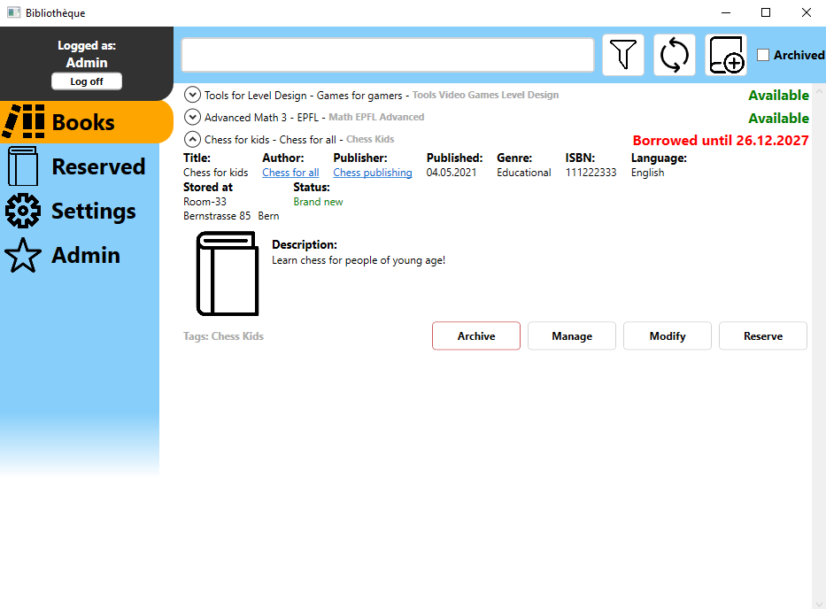
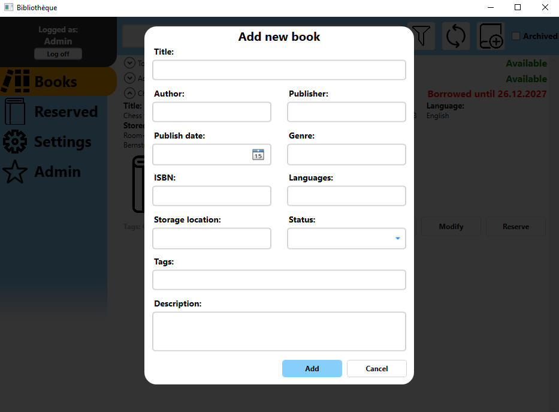
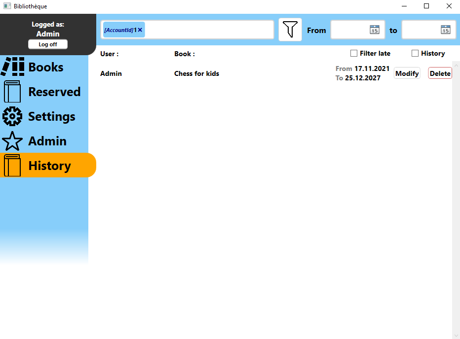
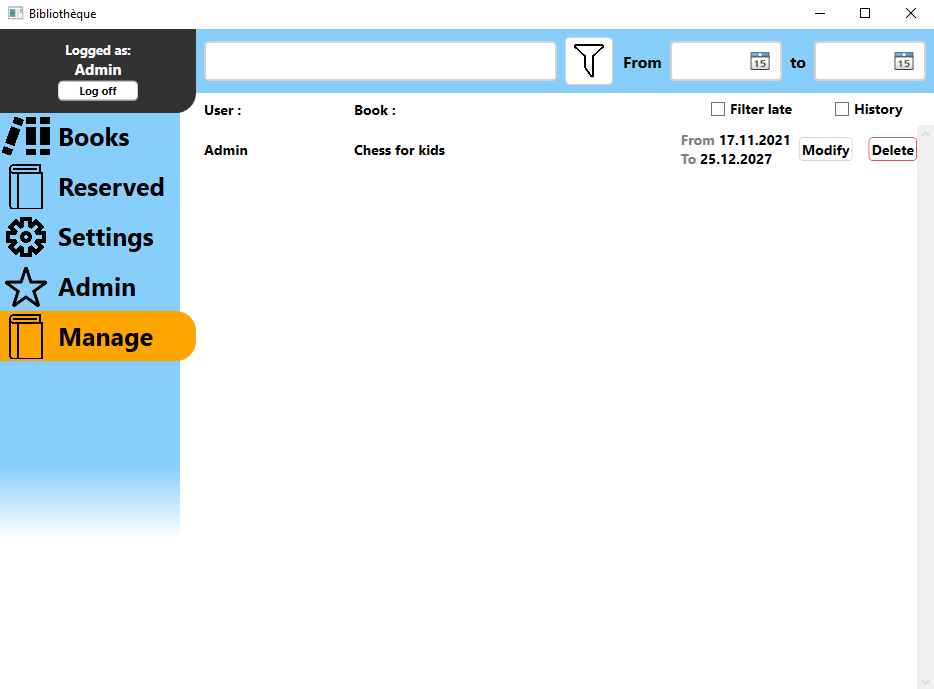

# This repo is for Portfolio purposes

Made in 3 weeks for an association to keep track of their book storage and manage reservations of said books.

Changes from the original:
-Partially translated from French to English
-Migrated from mySQL to SQLite

It comes with a default admin user with no password required.

